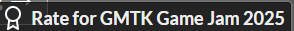
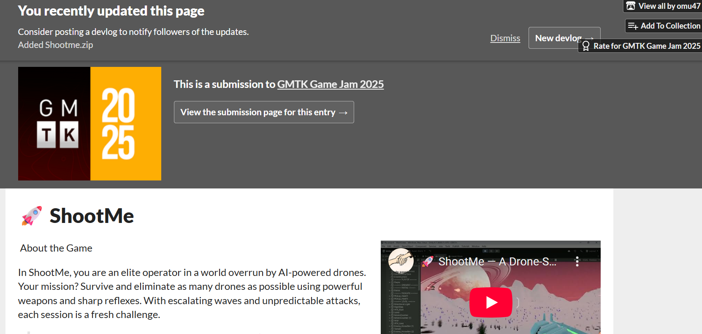

# 🚀 ShootMe — A D## ⚙️ How to Run the Game

⚠️ **IMPORTANT**: The game requires a special starter file to launch properly.

📩 **To get the Starter File**, please contact me or request it through the Drive link:

> 🔗 **Drive Link**: [Download Starter File](https://drive.google.com/file/d/1LRPxajeD5_kbIKjvSvWWnOr_AFuSB5AF/view?usp=drivesdk)

Once you have the starter file, place it in the required directory (instructions will be provided with the file), and you'll be good to go!ing FPS Experience

**🎮 GMTK Game Jam 2025 Submission** 🏆

Welcome to **ShootMe**, a high-speed, reflex-testing first-person shooter where you take down waves of **autonomous attacking drones** in an intense, futuristic battlefield. Designed for fast fun and addictive action, ShootMe will keep your fingers on the trigger and your mind sharp!

> 🔗 **Jam Entry**: [View on GMTK Game Jam 2025](https://itch.io/jam/gmtk-2025/rate/3781740)

---

## 🎮 About the Game

In **ShootMe**, you are an elite operator in a world overrun by AI-powered drones. Your mission? **Survive and eliminate** as many drones as possible using powerful weapons and sharp reflexes. With escalating waves and unpredictable attacks, each session is a fresh challenge.

> _"No mercy, no escape — just you and the swarm."_ 🧠💥

---

## ⚙️ How to Run the Game

⚠️ **IMPORTANT: The game requires a special Starter File to launch properly.**

📩 **To get the Starter File**, please contact me or request it through the Drive link:

> 🔗 [https://drive.google.com/file/d/1LRPxajeD5_kbIKjvSvWWnOr_AFuSB5AF/view?usp=drivesdk]

Once you have the starter file, place it in the required directory (instructions will be provided with the file), and you’ll be good to go!

---

## 🎥 Gameplay Demo & Screenshots

📌 **Play the Game**: 
> 🎮 **Visit**: https://itch.io/jam/gmtk-2025/rate/3781740

📸 **Screenshots**:

*Experience intense drone combat in futuristic environments*

---

## 🎮 Controls

📌 **Game Controls**:

---

## 🔧 Features

- 🧠 AI-powered enemy drones with unique attack patterns
- 🎯 FPS mechanics with satisfying weapon feedback
- 🌌 Futuristic battlefield with immersive environments
- 🔁 Infinite wave mode for endless replayability
- 📊 Lightweight, no installation required (just starter file)
- 🌐 **Alternative**: Download directly from itch.io platform without any starter file needed
- 🏆 **GMTK Game Jam 2025 Entry** - Built within the jam timeframe

---

## 💡 Coming Soon

- 🔀 Multiplayer arena mode  
- ⚔️ Custom weapon loadouts  
- 🏅 Leaderboards and online scoring

---

## 👤 Developer

Made with ❤️ using Unity by **Ayu9002** | Mentored by **omu47** for **GMTK Game Jam 2025**  
Reach out if you have ideas, feedback, or drone-related nightmares. 😉

**Jam Theme**: Loop  
**Development Time**: 48 hours (GMTK Game Jam 2025)

---

## 📄 License

This project is currently private. Redistribution, reverse-engineering, or unauthorized use of assets is prohibited without permission.

